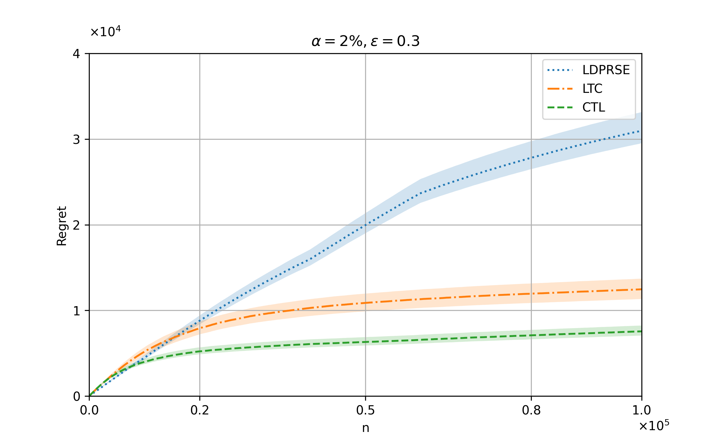

The results presented below compare our specific algorithm with algorithm proposed in [Tao (2022)](https://proceedings.mlr.press/v151/tao22a.html), namely `LDPRSE`. These comparisons were made in an online MABs setting under weak corruption conditions. The findings are organized into two columns, demonstrating the impact of varying alpha values on performance as epsilon increases.

- **Left Column (Alpha = 2%)**: As epsilon increases, `we observe that the performance curve not only aligns with our theoretical results but also surpasses LDPRSE`. This showcases the efficiency and effectiveness of our approach under lower alpha settings.
- **Right Column (Alpha = 7%)**: Consistent with the observations made in the left column, when the privacy parameter (epsilon) remains constant, an increase in alpha leads to poorer performance. 

<table>
  <tr>
    <td></td>
    <td></td>
  </tr>
  <tr>
    <td></td>
    <td></td>
  </tr>
  <tr>
    <td></td>
    <td></td>
  </tr>
</table>

These highlights the advantages of our methodology over `LDPRSE` in online environments.
